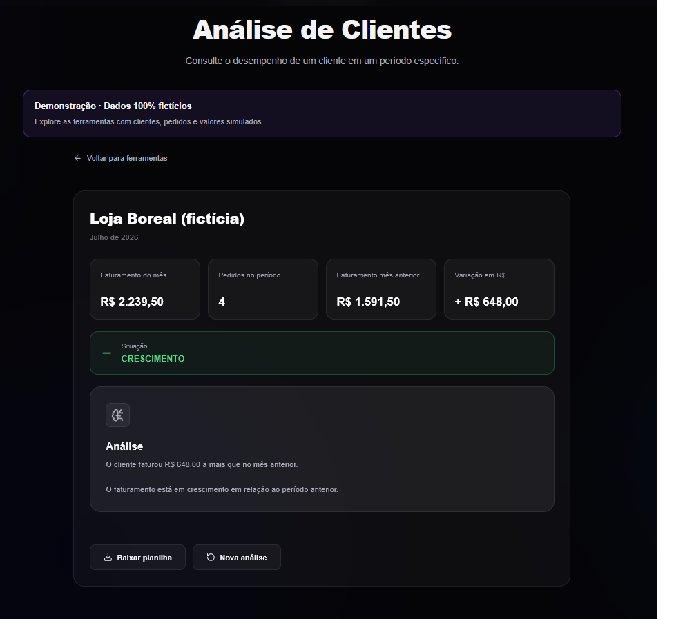
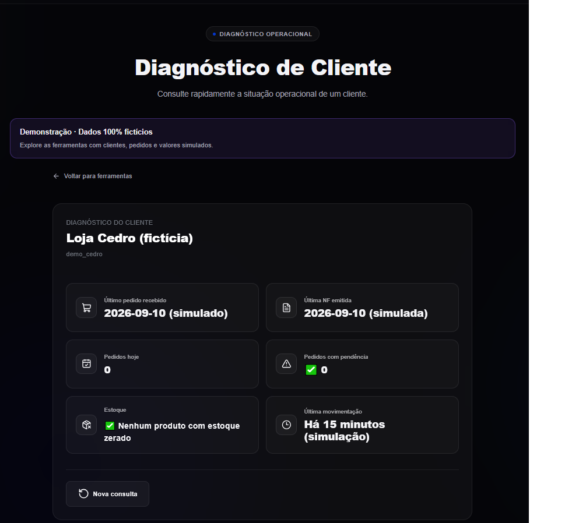
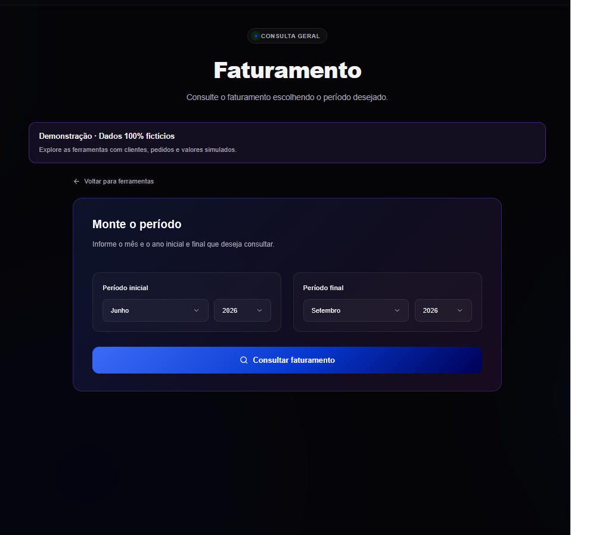
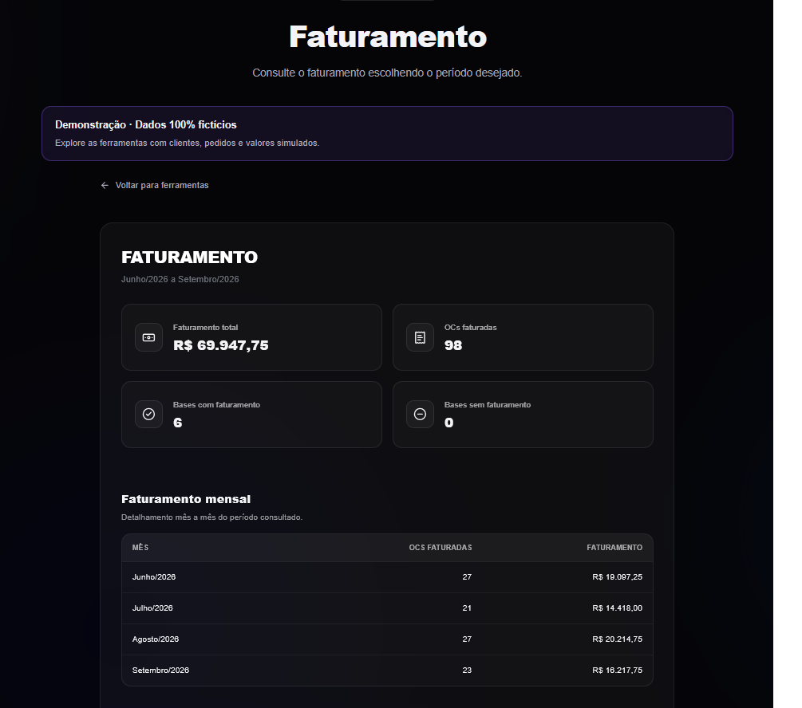
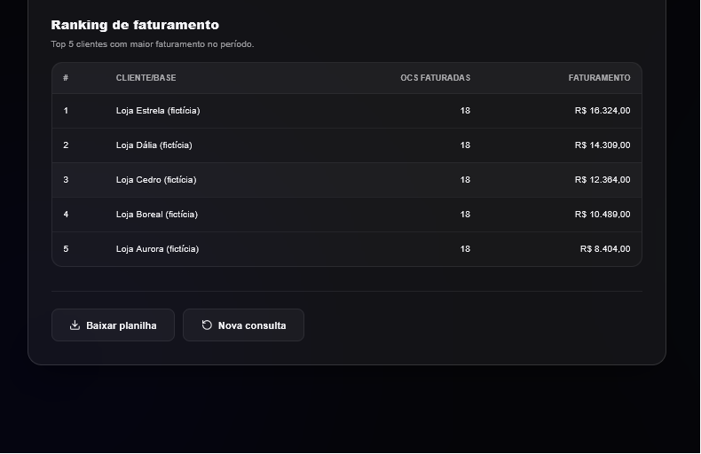

# CFI — Centro de Ferramentas Internas

Aplicação de demonstração para análise de clientes e faturamento, construída com Python e Flask. Esta versão utiliza **somente dados fictícios**.

## Funcionalidades

| Módulo | Disponibilidade |
| --- | --- |
| Análise de clientes | Consulta de dados fictícios e exportação para Excel. |
| Faturamento | Consolidação de valores fictícios e exportação para Excel. |
| Diagnóstico de cliente | Análise demonstrativa com dados fictícios. |
| Comissão de clientes | Desativada na versão pública. |

A comissão de clientes depende de consultas reais a clientes e de regras internas do sistema original. Esses acessos não fazem parte deste repositório. A tela permanece apenas para informar essa limitação: o botão está desativado e as rotas de geração e download também estão bloqueadas. Nenhum relatório de comissão é gerado.

## Telas da aplicação

Capturas da versão de demonstração, com clientes e valores fictícios.

### Análise de clientes

Indicadores do mês, comparação com o período anterior e opção de exportação para Excel.



### Diagnóstico de cliente

Resumo operacional com pedidos, notas fiscais, estoque e movimentações simuladas.



### Faturamento

Seleção do período de consulta.



Resultado consolidado e detalhamento mensal.



Ranking dos cinco clientes com maior faturamento e opção de download da planilha.



## Executar localmente

Instale o Python 3.12 e abra o terminal na pasta do projeto.

**Windows:**

```powershell
py -m venv .venv
.\.venv\Scripts\python.exe -m pip install -r requirements.txt
.\.venv\Scripts\python.exe app.py
```

**Linux ou macOS:**

```bash
python3 -m venv .venv
.venv/bin/python -m pip install -r requirements.txt
.venv/bin/python app.py
```

Acesse **http://127.0.0.1:5000** e mantenha o terminal aberto. Para encerrar, pressione `Ctrl+C`.

As páginas precisam ser servidas pelo Flask. Abrir os arquivos HTML diretamente, pelo Live Server ou pelo GitHub Pages não executa esta aplicação. Não é necessário configurar banco de dados, credenciais ou chaves de API.

## Estrutura

| Arquivo ou pasta | Finalidade |
| --- | --- |
| `app.py` | Inicialização da aplicação e rotas. |
| `services/` | Dados fictícios e processamento dos módulos. |
| `templates/` | Páginas renderizadas pelo Flask. |
| `static/` | Estilos e scripts da interface. |
| `docs/imagens/` | Capturas de tela utilizadas neste README. |
| `requirements.txt` | Dependências para executar o sistema. |

## Tecnologias e limites

Python, Flask, openpyxl, HTML, CSS e JavaScript. As planilhas são geradas com dados simulados, sem representar clientes ou resultados reais. Fontes e ícones da interface usam recursos externos e podem depender de internet.

Esta versão foi preparada para demonstração local. As tarefas de diagnóstico ficam na memória e são perdidas ao reiniciar a aplicação.
